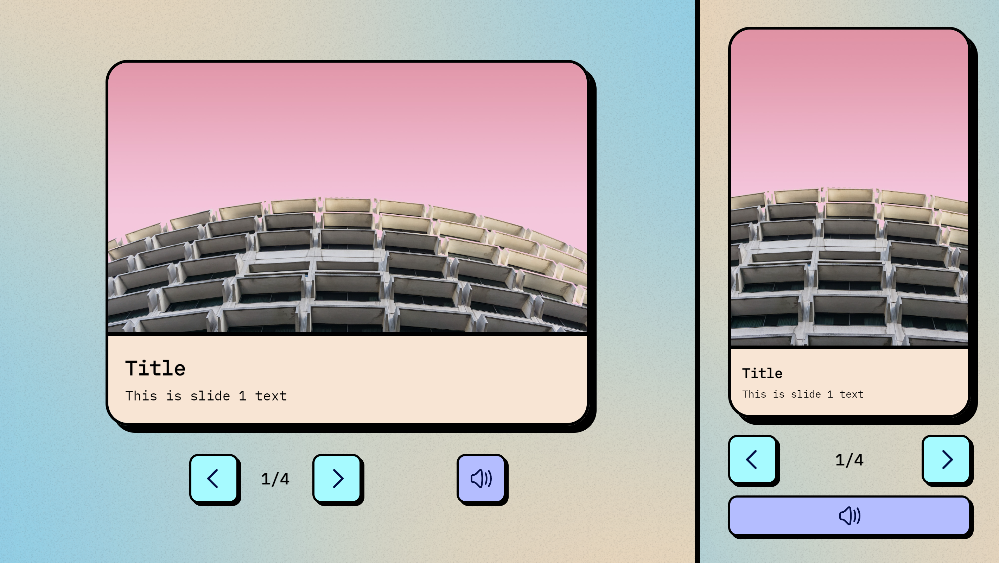

# slider-recruitment-task

Slide presentation application created for the recruitment process.
## Run Locally

- clone the entire repository
```bash
  git clone https://github.com/Ernest-K/slider-recruitment-task.git
```
- Navigate to the project folder and run with one command
```bash
  cd slider-recruitment-task
  npm install && npm run start
```
React app will start running at http://localhost:5173 if the port will not be occupied.

The server will start running at http://localhost:3001


## Running Tests

To run tests, run the following command

```bash
  npm run test
```


## Screenshots



## Tech Stack

**Client:** Vite, React, Typescript

**Server:** Node

